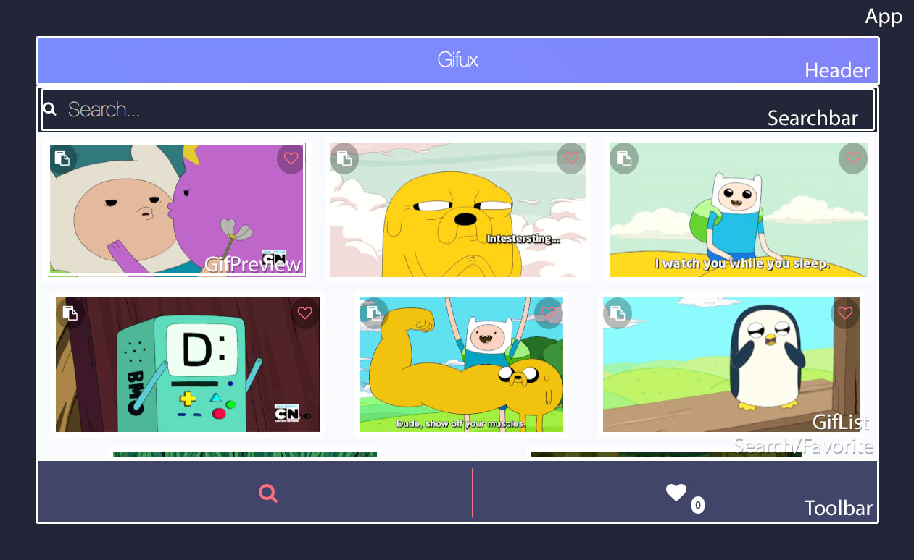
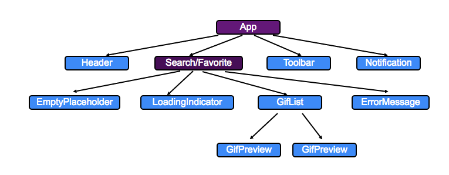

title: React + Redux - A better way to build javascript apps
author:
  twitter: axelhzf
  url: http://axelhzf.com
output: index.html
controls: false
theme: ./theme

-- cover


## REACT + REDUX

## A BETTER WAY TO BUILD JAVASCRIPT APPS

-- twitter

<blockquote class="twitter-tweet" data-lang="en"><p lang="es" dir="ltr">El ganador del <a href="https://twitter.com/hashtag/TreexorChallenge?src=hash">#TreexorChallenge</a> se llevará una suscripción de 6 meses en <a href="https://twitter.com/eggheadio">@eggheadio</a>. Superarás la prueba? <a href="https://t.co/dzpb7rR2WH">pic.twitter.com/dzpb7rR2WH</a></p>&mdash; Treexor (@treexor) <a href="https://twitter.com/treexor/status/753568426560454656">July 14, 2016</a></blockquote>

--


--

## The best way to learn a new technology is to build something

http://axelhzf.com/gifux

--

## JavaScript Fatigue

https://medium.com/@ericclemmons/javascript-fatigue-48d4011b6fc4

-- twitter

<blockquote class="twitter-tweet" data-lang="en"><p lang="en" dir="ltr"><a href="https://twitter.com/dan_abramov">@dan_abramov</a> <a href="https://twitter.com/floydophone">@floydophone</a> this is killing me that setting up a js project is so damn hard. Took me an entire evening last time</p>&mdash; Vjeux (@Vjeux) <a href="https://twitter.com/Vjeux/status/680236138171244544">December 25, 2015</a></blockquote>

--

## JavaScript Fatigue Fatigue

http://www.2ality.com/2016/02/js-fatigue-fatigue.html

--

* Don’t try to know everything
* Do exploratory toy projects
* Wait for the critical mass

-- twitter

<blockquote class="twitter-tweet" data-lang="en"><p lang="en" dir="ltr">Welcome back <a href="https://twitter.com/tjholowaychuk">@tjholowaychuk</a> <a href="https://t.co/TSlIY37wW4">https://t.co/TSlIY37wW4</a></p>&mdash; Dan Abramov (@dan_abramov) <a href="https://twitter.com/dan_abramov/status/682368983547416577">December 31, 2015</a></blockquote>

--

## React

--

## React is a library to build user interfaces

--

## React is all about modular and composable components

--

```js
import React from "react";
import ReactDOM from "react-dom";

export default class HelloWorld extends React.Component {
  render() {
    return (
      <div>
        <h1>Hello World</h1>
      </div>
    );
  }
}

ReactDOM.render(<HelloWorld />, document.getElementById('container'));
```

--

## HTML inside a JavaScript?


--

## Didn't we escape PHP years ago?


--

## It's JSX.

--

## JSX compiles to

```js
React.createElement("div",null,
  React.createElement("h1",null,"Hello World")
);
```

--

## But, where is the separation of concerns?

--

## React: rethinking best practices

https://www.youtube.com/watch?v=x7cQ3mrcKaY

--

## Templates encourages a poor separation of concerns.

--

## Templates separates technologies, not concerns.

--

## JSX benefits

* Fails at compile time
* Line number provided
* Debuggable

--


--

## Angular 2 continues to put “JS” into HTML. React puts “HTML” into JS.

--

### To read Angular: Learn a long list of Angular-specific syntax.

### To read React: Learn JavaScript.

--

## Render a list in Angular 2

```js
<ul>
  <li *ngFor="#hero of heroes">
    {{hero.name}}
  </li>
</ul>
```

--


--

## Render a list in React

```js
<ul>
  { heroes.map(hero => <li key={hero.id}>{hero.name}</li>) }
</ul>
```

--


--

## Props

Data passed in from a parent component is available as a 'property' on the child component. These 'properties' are accessed through `this.props`.

```js
export default class Hello extends React.Component {
  render() {
    const {name} = this.props;
    return <h1>Hello {name}</h1>;
  }
}
```

```js
<HelloWorld name="Treexor"/>;
```

--

## State

Components can have it's own private mutable state `this.state`. The state can be changed by calling `this.setState()`.

--

```js
import React from "react";

export default class HelloWorld extends React.Component {
  state = { counter: 0};
  increment = () => this.setState({counter: this.state.counter + 1})
  render() {
    const {counter} = this.state;
    return (
      <div>
        <h1>Counter {counter}</h1>
        <button onClick={this.increment}>Increment</button>
      </div>
    );
  }
}
```

--

## Redux

--

##  Redux is a predictable state container for JavaScript apps.

--


--

## State

* Applications needs to store complex state
* State from server responses
* State from UI (selected tab, spinners, pagination)
* Share state between independent components

--

## MVC


--

## Real world MVC


--

> When a system is opaque and non-deterministic, it’s hard to reproduce bugs or add new features.

--

> Mutation and asynchronicity create a mess. We need to find a way to make our state more predictable.

--

## Introducing Redux

https://www.youtube.com/watch?v=xsSnOQynTHs

--

## Redux
* Inspired on flux and elm
* Minimal api
* Completely predictable behaviour
* Not React specific, it's just an event and state management library

--

## Redux Principles

--

## SINGLE SOURCE OF TRUTH

* The state of the whole application is stored in an object tree within a single store
* Easy to share information across components
* Easy to debug
* We can easily save and restore the state of the whole application
* Undo/redo, hot reloading, trace production error

--

```js
var state = {
  visibilityFilter: 'SHOW_ALL',
  todos: [
    { text: 'Consider using Redux', completed: true},
    { text: 'Keep all state in a single tree', completed: false}
  ]
};
```

--

## State is read-only

* The only way to mutate the state is to emit and action, an object describing what happened.
* Views or http callbacks don't modify the state, instead they express the intention to mutate the state.
* Actions can be logged for debugging or stored for testing purposes

--

```js
store.dispatch({
  type: 'COMPLETE_TODO',
  index: 1
});

store.dispatch({
  type: 'SET_VISIBILITY_FILTER',
  filter: 'SHOW_COMPLETED'
});
```

--

## Changes are made with pure functions

* These pure functions are called reducers

```js
(previousState, action) => newState
```

--

```js
function reducer(state, action) {
  switch (action.type) {
    case 'SET_VISIBILITY_FILTER':
      var newState = _.clone(state);
      newState.filter = action.filter;
      return newState;

    case 'SET_COMPLETE_TODO':
      var newState = _.clone(state);
      newState.todos[action.index].completed = true;
      return newState;

    default:
      return state
  }
}
```

--


--

## Redux lessons by Dan Abramov

https://egghead.io/courses/getting-started-with-redux
https://egghead.io/courses/building-react-applications-with-idiomatic-redux

--

## Gifux

--

## Clone the repo

```js
git clone https://github.com/axelhzf/talk-react-redux-tlp2k16-code.git
git checkout -f 82f8b37
```

--

## Run the application

```cmd
npm install
npm start
```

--

## Analyzing the application



--

## Components tree



--

## Components vs Containers

https://medium.com/@dan_abramov/smart-and-dumb-components-7ca2f9a7c7d0#.ph7md8nhg

--

## Components communication


--

## React + Redux integration using [react-redux](https://github.com/reactjs/react-redux)

https://github.com/axelhzf/talk-react-redux-tlp2k16-code/commit/4ed504bfcbe93d612d50e43c4c1be83a2ae2f2f4

```cmd
git checkout -f 4ed504b
```

--

## Connect is a High Order Component

https://gist.github.com/sebmarkbage/ef0bf1f338a7182b6775

https://medium.com/@dan_abramov/mixins-are-dead-long-live-higher-order-components-94a0d2f9e750

--

## Immutable options

* [_.cloneDeep](https://lodash.com/docs#cloneDeep)
* [immutability-helper](https://www.npmjs.com/package/immutability-helper)
* [Immutable.js](https://facebook.github.io/immutable-js/)

--

## PERSISTENT IMMUTABLE DATA STRUCTURES

https://www.youtube.com/watch?v=mS264h8KGwk
https://www.youtube.com/watch?v=I7IdS-PbEgI

--

## Structural sharing


--

## Immutability helper integration

https://github.com/axelhzf/talk-react-redux-tlp2k16-code/commit/872f4cea930a7723c87b432bc0159cde06c5777f

```cmd
git checkout -f 872f4ce
```

--

## Fetch data from an API

https://github.com/axelhzf/talk-react-redux-tlp2k16-code/commit/2e67c96b04d21e2d915980e9a14edf08a4374de5

```cmd
git checkout -f 2e67c96
```

--

## Fetch favorites

https://github.com/axelhzf/talk-react-redux-tlp2k16-code/commit/84388df6a9fbf2ab3e360ea4436a2ebf4374a2e9

```cmd
git checkout -f 84388df
```

--

## Toggle favorites

https://github.com/axelhzf/talk-react-redux-tlp2k16-code/commit/b37d36025fb007ad839197ca9c371f1331ab0722

```cmd
git checkout -f b37d360
```

--

## Caching

https://github.com/axelhzf/talk-react-redux-tlp2k16-code/commit/5239ba24ce90f50c997594134567b02763de4296

```cmd
git checkout -f 5239ba2
```

* You can also use [normalizr](https://github.com/paularmstrong/normalizr)

--

## Show notifications

https://github.com/axelhzf/talk-react-redux-tlp2k16-code/commit/7c085a6e5bd7329dce221a443c69e8e0fd477011

```cmd
git checkout -f 7c085a6
```

--

## Local Storage

https://github.com/axelhzf/talk-react-redux-tlp2k16-code/commit/986008ec556519a75940204e6102336b4b03c804

```cmd
git checkout -f 986008e
```

--

## Undo

https://github.com/axelhzf/talk-react-redux-tlp2k16-code/commit/11d78507aa7a391eebfb32265f1bcd02fa6cc71a

```cmd
git checkout -f 11d7850
```

<script async src="http://platform.twitter.com/widgets.js" charset="utf-8"></script>
<script type="text/javascript">
    var _gaq = _gaq || [];
    _gaq.push(['_setAccount', 'UA-31904298-1']);
    _gaq.push(['_trackPageview']);

    (function() {
        var ga = document.createElement('script'); ga.type = 'text/javascript'; ga.async = true;
        ga.src = ('https:' == document.location.protocol ? 'https://ssl' : 'http://www') + '.google-analytics.com/ga.js';
        var s = document.getElementsByTagName('script')[0]; s.parentNode.insertBefore(ga, s);
    })();
</script>